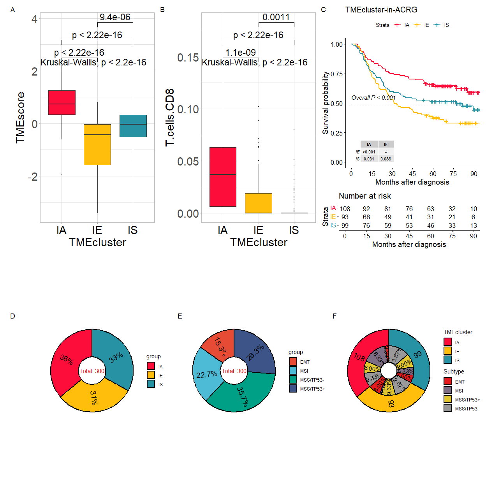

<!-- README.md is generated from README.Rmd. Please edit that file -->

# TMEclassifier

TMEclassifier is an R package to perform tumor microenvironment
classification based on TME characteristics of gastric cancer.

### 1.Introduction

-   1.TMEclassifier was designed to classify the tumor microenvironment
    (TME) of gastric cancer and even other cancers.
-   2.This package consists an ensemble classification model integrating
    6 machine learning algorithms:`Support Vector Machine (SVM)`,
    `Random Forest (RF)`, `Neural Networks (NNET)`,
    `k-Nearest Neighbor (KNN)`, `Decision Tree (DecTree)`,
    `eXtreme Gradient Boosting (XGBoost)`.
-   3.TMEclassifier identifies three TME-clusters based on expression
    profiles of 134 TME-related genes and ensemble models.
-   4.In addition, TMEclassifier provides functions for multi-scale
    visualization of TMEcluster and some functions depend on `IOBR`,
    which was developed by our team previously. The research about IOBR
    can be reached by this
    [link](https://pubmed.ncbi.nlm.nih.gov/34276676/).

#### Graphical abstract for construction and clinical application of TMEclassifier


### 2.Installation

It is essential that you have R 3.6.3 or above already installed on your
computer or server. Before installing TMEclassifier, please install all
dependencies by executing the following command in R console:

The dependencies includes `caret`, `e1071`, `crayon`, `ggplot2`,
`scales`, `tibble`, `IOBR`, `ggplot2` and `ggpubr`.

``` r
if (!requireNamespace("BiocManager", quietly = TRUE)) install.packages("BiocManager")

depens<-c("crayon", "ggplot2", "scales", "tibble", "caret", "e1071", "randomForest", "xgboost", "ggpp", "kernlab", "ComplexHeatmap", "survminer", "ggpubr")
for(i in 1:length(depens)){
  depen<-depens[i]
  if (!requireNamespace(depen, quietly = TRUE))
    BiocManager::install(depen,update = FALSE)
}
```

The package is not yet on CRAN or Bioconductor. You can install it from
Github:

``` r
if (!requireNamespace("TMEclassifier", quietly = TRUE))
  devtools::install_github("LiaoWJLab/TMEclassifier")
#> Warning: 程辑包'tidyHeatmap'是用R版本4.2.3 来建造的
```

Library R packages

``` r
library(TMEclassifier) 
```

### 3.Usage

``` r
data("eset_example1")
res<-tme_classifier(eset = t(eset_example1), method = "ensemble", scale = T)
#> Step-1: Expression data preprocessing...
#> >>> There are no missing values
#> 
#> Step-2: TME deconvolution...
#> >>> This step was skipped, user can set parameter `tme_deconvolution` to TRUE or provide TME data to realize prediction.
#> 
#> Step-3: Predicting TME phenotypes...
#> >>>-- Scaling data...
#> >>>--- Ensemble Model was used to predict TME phenotypes...
#> [14:54:19] WARNING: amalgamation/../src/learner.cc:1040: 
#>   If you are loading a serialized model (like pickle in Python, RDS in R) generated by
#>   older XGBoost, please export the model by calling `Booster.save_model` from that version
#>   first, then load it back in current version. See:
#> 
#>     https://xgboost.readthedocs.io/en/latest/tutorials/saving_model.html
#> 
#>   for more details about differences between saving model and serializing.
#> 
#> [14:54:19] WARNING: amalgamation/../src/learner.cc:749: Found JSON model saved before XGBoost 1.6, please save the model using current version again. The support for old JSON model will be discontinued in XGBoost 2.3.
#> 
#> >>>--- DONE!
head(res)
#>           ID       TMEA       TMEB       TMEC TMEcluster
#> 1 GSM1523727 0.14378383 0.09860092 0.75761525       TMEC
#> 2 GSM1523728 0.00769956 0.10048409 0.89181635       TMEC
#> 3 GSM1523729 0.86870675 0.10316410 0.02812915       TMEA
#> 4 GSM1523744 0.04996065 0.06216853 0.88787082       TMEC
#> 5 GSM1523745 0.05508487 0.81613011 0.12878502       TMEB
#> 6 GSM1523746 0.56659350 0.38249992 0.05090658       TMEA
table(res$TMEcluster)
#> 
#> TMEA TMEB TMEC 
#>   93   99  108
```

### 4.Visualization

Functions applied to visualization were depends on the IOBR R package.
Users can install it from [Github](https://github.com/IOBR/IOBR):

``` r
if (!requireNamespace("IOBR", quietly = TRUE))
  devtools::install_github("IOBR/IOBR")
library(IOBR)
```

Combining TMEcluster data and phenotype data.

``` r
data("pdata_example")
input<-inner_join(res, pdata_example, by = "ID")
input[1:5, 1:8]
#>           ID       TMEA       TMEB       TMEC TMEcluster ProjectID  Technology
#> 1 GSM1523727 0.14378383 0.09860092 0.75761525       TMEC  GSE62254 Affymetrix 
#> 2 GSM1523728 0.00769956 0.10048409 0.89181635       TMEC  GSE62254 Affymetrix 
#> 3 GSM1523729 0.86870675 0.10316410 0.02812915       TMEA  GSE62254 Affymetrix 
#> 4 GSM1523744 0.04996065 0.06216853 0.88787082       TMEC  GSE62254 Affymetrix 
#> 5 GSM1523745 0.05508487 0.81613011 0.12878502       TMEB  GSE62254 Affymetrix 
#>         platform
#> 1 HG-U133_Plus_2
#> 2 HG-U133_Plus_2
#> 3 HG-U133_Plus_2
#> 4 HG-U133_Plus_2
#> 5 HG-U133_Plus_2
```

Box plot

``` r
cols<- c('#fc0d3a','#ffbe0b','#2692a4')
p1<-sig_box(data = input, signature = "TMEscore", variable = "TMEcluster", cols = cols, hjust = 0.5)
#> # A tibble: 3 × 8
#>   .y.       group1 group2        p    p.adj p.format p.signif method  
#>   <chr>     <chr>  <chr>     <dbl>    <dbl> <chr>    <chr>    <chr>   
#> 1 signature TMEC   TMEA   3.66e-24 1.10e-23 < 2e-16  ****     Wilcoxon
#> 2 signature TMEC   TMEB   1.18e-17 2.40e-17 < 2e-16  ****     Wilcoxon
#> 3 signature TMEA   TMEB   9.44e- 6 9.40e- 6 9.4e-06  ****     Wilcoxon
#> Warning: Removed 1 rows containing non-finite values (`stat_boxplot()`).
#> Warning: Removed 1 rows containing non-finite values (`stat_signif()`).
#> Warning: Removed 1 rows containing non-finite values (`stat_compare_means()`).
p2<-sig_box(data = input, signature = "T.cells.CD8", variable = "TMEcluster", cols = cols, hjust = 0.5)
#> # A tibble: 3 × 8
#>   .y.       group1 group2        p    p.adj p.format p.signif method  
#>   <chr>     <chr>  <chr>     <dbl>    <dbl> <chr>    <chr>    <chr>   
#> 1 signature TMEC   TMEA   1.06e- 9 2.10e- 9 1.1e-09  ****     Wilcoxon
#> 2 signature TMEC   TMEB   7.54e-18 2.3 e-17 < 2e-16  ****     Wilcoxon
#> 3 signature TMEA   TMEB   1.09e- 3 1.1 e- 3 0.0011   **       Wilcoxon
```

KM-plot

``` r
library(survminer)
p3<-surv_cluster(input_pdata     = input,
                 target_group    = "TMEcluster",
                 time            = "OS_time",
                 status          = "OS_status",
                 project         = "ACRG",
                 cols            = c('#fc0d3a','#ffbe0b','#2692a4'),
                 save_path       = paste0("./man/figures"))
#> TMEA TMEB TMEC 
#>   93   99  108
```

Distribution of `TMEcluster` and molecular subtypes

``` r
# install.package("remotes")   #In case you have not installed it.
if (!requireNamespace("ggpie", quietly = TRUE)) 
  remotes::install_github("showteeth/ggpie")
library(ggpie)
p4<-ggdonut(data = input, group_key = "TMEcluster", count_type = "full",
        label_info = "ratio", label_type = "circle", label_split = NULL,
        label_size = 5, label_pos = "in",  donut.label.size = 4)+
  scale_fill_manual(values = cols)

p5<-ggdonut(data = input, group_key = "Subtype", count_type = "full",
            label_info = "ratio", label_type = "circle", label_split = NULL,
            label_size = 5, label_pos = "in",  donut.label.size = 4)+
  scale_fill_manual(values = palettes(palette = "nrc", show_col = FALSE, show_message = FALSE))
#########################################
p6<-ggnestedpie(data                  = input, 
                group_key             = c("TMEcluster", "Subtype"),
                count_type            = "full",
                inner_label_info      = "ratio",
                inner_label_split     = NULL,
                inner_labal_threshold = 5, 
                inner_label_size      = 3, 
                outer_label_type      = "circle",
                outer_label_size      = 5,
                outer_label_pos       = "in", 
                outer_label_info      = "count")+
  scale_fill_manual(values = cols)
```

Combination of plots

``` r
if (!requireNamespace("patchwork", quietly = TRUE)) 
  install.packages("patchwork")
library(patchwork)
p<-(p1|p2|p3)/(p4|p5|p6)
p + plot_annotation(tag_levels = 'A')
#> Warning: Removed 1 rows containing non-finite values (`stat_boxplot()`).
#> Warning: Removed 1 rows containing non-finite values (`stat_signif()`).
#> Warning: Removed 1 rows containing non-finite values (`stat_compare_means()`).
```



### 5.Phenotype of TMEclusters defined by gastric cancer.


## References

1.Zeng D, Yu Y, Qiu W, Mao Q, …, Zhang K, Liao W; Tumor microenvironment
immunotyping heterogeneity reveals distinct molecular mechanisms to
clinical immunotherapy applications in gastric cancer. (2023) *Under
Review*.

2.Zeng D, Li M, …, Liao W; [Tumor microenvironment characterization in
gastric cancer identifies prognostic and imunotherapeutically relevant
gene
signatures](https://cancerimmunolres.aacrjournals.org/content/7/5/737).
*Cancer Immunology Research*, 2019, 7(5), 737-750. DOI:
10.1158/2326-6066.CIR-18-0436, PMID: 30842092

3.Zeng D, Ye Z, Sheng R, Yu G, Xiong Y, …, Liao W; [IOBR: Multi-omics
Immuno-Oncology Biological Research to decode tumor microenvironment and
signatures](https://www.frontiersin.org/articles/10.3389/fimmu.2021.687975/full).
*Frontiers in Immunology*, 2021, 12:687975. DOI:
10.3389/fimmu.2021.687975, PMID: 34276676

## Reporting bugs

Please report bugs to the [Github issues
page](https://github.com/IOBR/TMEclassifier/issues)

E-mail any questions to <dongqiangzeng0808@gmail.com>
